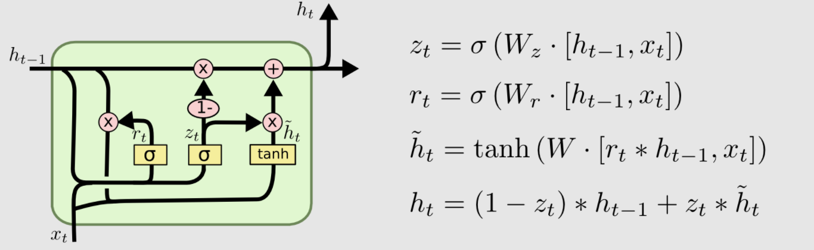

# Gold Price Prediction (Time Series) using Gated Recurrent Unit (GRU)

This repository is about Deep Learning to predict the gold price in Indonesia from Indogold.

Dataset used in this repository is retrieved from [Indogold](https://www.indogold.id/harga-emas-hari-ini)

Here are the dataset descriptions and properties:
The dataset was scraped from Indogold website. Indogold is an online gold trading platform. Indogold started as a family business engaged in buying and selling gold-certified precious metal PT. Antam since 1978. The products offered are LM UBS and LM Antam gold trading. Starting in 2018, Indogold obtained a pawn permit from the OJK with the number KEP - 50/NB.1/2018. With this permit, Indogold is able to provide mortgage, installment, and buying and selling facilities for gold with deposit facilities. In addition to the pawn permit, on April 1, 2019, Indogold was officially registered with the OJK for Digital Financial Innovation (OJK Infinity) with the number S-102/MS.72/2019. Indogold is included in the online gold storage cluster. Online gold storage is a fintech application for buying and selling gold with deposit facilities. As of February 2019, Indogold has 600,000 users. This amount is a combination of users of the Indogold platform and users who buy and sell gold via their e-commerce partners. 

The dataset that I have scraped consists of the date, as well as the purchase price and selling price of 99.99% gold. The dataset consists of 1096 rows from February 21, 2019, to February 20, 2022. The meaning of the purchase price is when the customer buys gold at Indogold, while the purpose of the selling price is when the customer sells gold to Indogold. I am providing the dataset in this repository.

___

Gated Recurrent Unit (GRU) is a type of  Neural Network (RNN) and deep learning technique proposed by (Cho, et al.) in 2014 \[1\] tries to tackle the vanishing gradient problem that a normal RNN encounters. GRU can also be thought of as a variant of the LSTM because they are both designed similarly and, in some situations, yield similarly great outcomes. The GRU structure consists of an update gate and reset gate which aims to solve the vanishing gradient problem. \[2\]. Here is picture about GRU structure and equation:

where zt, rt, h(hat)t, and ht are update and reset gate, candidate activato vector, and output vector. xt is the input of the respective t-th time, ht−1 is the output vector of the respective t-1 time, whereas W and b is the weight and bias of the respective gate. σ is sigmoid function, ⊙ is Hadamard Product, and tanh is tan hyperbolic function.
___

### Conclusion

We train the model (GRU with Adam optimizer) in 500 epoch using huber loss criterion and learning rate reduction (ReduceLROnPlateau) from **Pytorch** Library. The result is, the model achieved 0.01365 of Training MAE and 0.01131 of Testing MAE on normalized dataset, and 4414.02344 of Testing MAE on denormalized MAE. The following are graphs that present the comparison between the actual buying and selling prices with the predicted ones

Actual Buy and Predicted Graph

Actual Sell and Predicted Graph

___

#### Source

\[1\] Cho, K., van Merrienboer, B., Gülçehre, Ç., Bougares, F., Schwenk, H., & Bengio, Y. (2014). Learning Phrase Representations using RNN Encoder-Decoder for Statistical Machine Translation. CoRR, abs/1406.1078. Opgehaal van http://arxiv.org/abs/1406.1078

\[2\] Kostadinov, S. (2017). Understanding GRU Networks. Towards Data Science. Retrieved February 22, 2022, from https://towardsdatascience.com/understanding-gru-networks-2ef37df6c9be