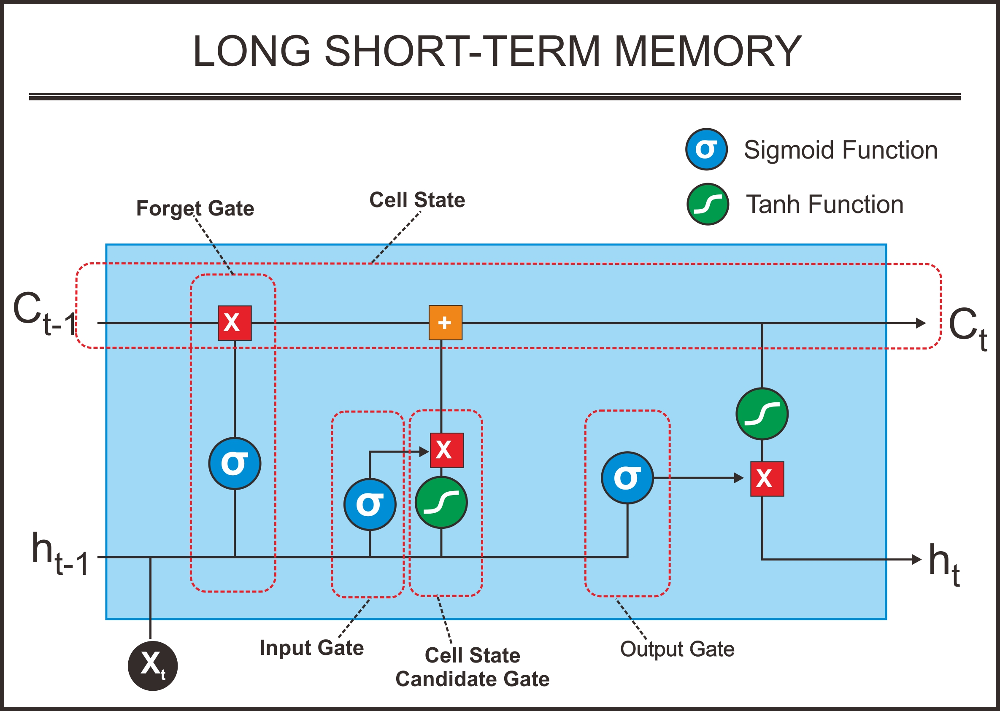
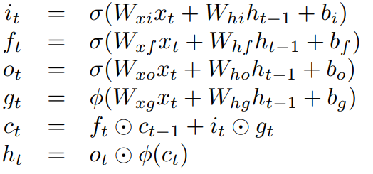
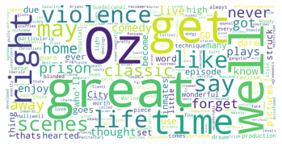
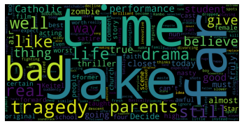

# Movie Review (Natural Language Processing-NLP) using Long Short-Term Memory (LSTM)

This repository is about Deep Learning to classify the sentiment of the movie review from IMDB dataset.

Dataset used in this repository is retrieved from [Kaggle](https://www.kaggle.com/lakshmi25npathi/imdb-dataset-of-50k-movie-reviews)

Here are the dataset descriptions ad properties:

IMDB dataset having 50K movie reviews for natural language processing or Text analytics.
This is a dataset for binary sentiment classification containing substantially more data than previous benchmark datasets. We provide a set of 25,000 highly polar movie reviews for training and 25,000 for testing. So, predict the number of positive and negative reviews using either classification or deep learning algorithms.
For more dataset information, please go through the following link:
[stanford](http://ai.stanford.edu/~amaas/data/sentiment/)
___

LSTM is a type of Recurrent Neural Network (RNN) and deep learning technique proposed by Hochreiter and Schimdhuber in 1997 to solve long-term time series problems. The LSTM structure consists of an input gate, forget gate, update gate, and an output gate. This structure can overcome the problem of vanishing and exploding gradients in traditional RNN \[1\]. Here is picture about LSTM structure:

___

### Conclusion

In this code, we used **TensorFlow** library. Using LSTM with Adam Optimizer, the model achieved 85.15% of Training Accuracy and 87.18% of Validation Accuracy. That's a pretty good accuracy on just 2 epochs of training and the model doesn't overfitting. When we test it using new IMDB movie review from Hawkeye series (2021), the model can predict the reviews correctly. Here are the word cloud images from the dataset: 

            *Positive Wordcloud*

            *Negative Wordcloud*

___

#### Source

\[1\] Wang, K., Qi, X., & Liu, H. (2019). Photovoltaic power forecasting based lstm-convolutional network. Energy, 189. doi:https://doi.org/10.1016/j.energy.2019.116225